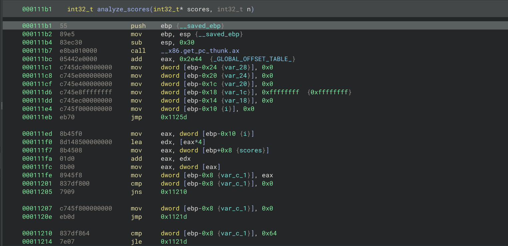
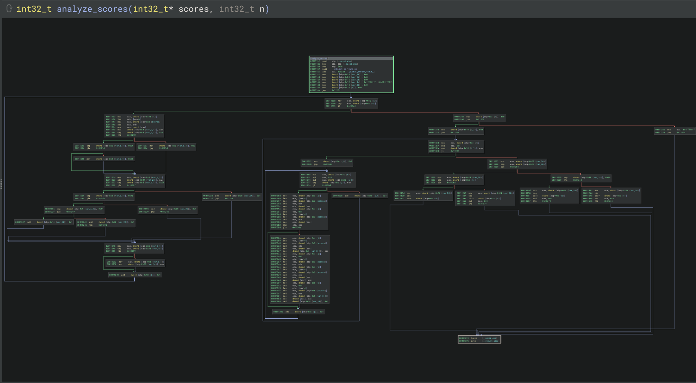
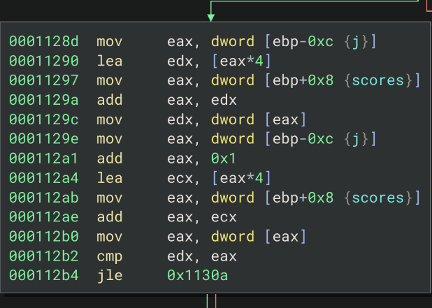

# Cross-Platform Binary Code Similarity Detection

### ამოცანის მიმოხილვა

* ამ პროექტში ვმუშაობთ *ბინარული კოდის მსგავსების ამოცნობის* (Binary Code Similarity Detection) ამოცანაზე. სანამ ტექნიკურ დეტალებზე გადავალთ, ავხსნათ, რას მოიცავს ეს ამოცანა და ასევე რა სირთულეებს წავაწყდით პროცესში.

* როდესაც პროგრამისტი წერს C კოდს (მაგალითად, OpenSSL ბიბლიოთეკის რომელიმე ფუნქციას), ეს კოდი პირდაპირ არ ეშვება პროცესორზე. ჯერ *კომპილატორი* (მაგ. gcc, clang) გადათარგმნის მას *მანქანურ კოდში*, ანუ პროცესორის ინსტრუქციების მიმდევრობაში. მიღებულ ფაილს *ბინარს* ვუწოდებთ, ხოლო მის ადამიანისთვის წაკითხვად ფორმას - *ასემბლის* (assembly).

* მთავარი პრობლემა ის არის, რომ *ერთი და იმავე C ფუნქციისგან შეიძლება სრულიად განსხვავებული ასემბლი მივიღოთ*. ამის რამდენიმე მიზეზი შეიძლება ჰქონდეს:
    1. *რომელი არქიტექტურისთვის ვაკომპილირებთ* - x86 პროცესორებს, ARM-ს (ტელეფონები, embedded მოწყობილობები) და MIPS-ს (როუტერები, IoT) სრულიად განსხვავებული ინსტრუქციების ნაკრები (ISA) აქვთ. სადაც x86-ზე mov ebp, esp წერია, ARM-ზე იმავე ადგილას შეიძლება push {fp, lr} იყოს. ანუ, გამოდის, რომ მათ საერთო არც ინსტრუქციის სახელი აქვთ და არც რეგისტრების სახელები.
    2. *რა ოპტიმიზაციის დონით ვაკომპილირებთ* - gcc`-ს აქვს დონეები `-O0 (ოპტიმიზაციის გარეშე), -O1, -O2, -O3. მაღალ დონეზე კომპილატორი აქტიურად გარდაქმნის კოდს: შლის ცვლადებს, აერთიანებს ციკლებს, აკეთებს inlining-ს (ანუ, ფუნქციის გამოძახების ნაცვლად, მთლიანად ამ ფუნქციის შიგთავსს აკოპირებს მიმდინარე კოდში). შედეგად, `-O0`-ზე დაკომპილირებული ფუნქცია და იგივე ფუნქცია `-O3`-ზე ვიზუალურად შეიძლება საერთოდ არ ჰგავდეს ერთმანეთს. გარდა ამისა, შესაძლოა ინსტრუქციების რაოდენობაც ბევრად განსხვავდებოდეს ერთმანეთისგან.


მაგალითად, ეს არის `analyze_scores` ფუნქცია (`math.c` ფაილში), რომელსაც გადაეცემა ქულების მასივი. ამ მასივს სორტავს ეს კოდი და აბრუნებს საშუალო ქულას + `bonus` იმის მიხედვით როგორი ქულებია ამ მასივში (ანუ მაქსიმალური ქულა თუ 100-ია და ა.შ):

```c
    int analyze_scores(int *scores, int n)
    {
        int total = 0;
        int passed = 0;
        int failed = 0;
        int highest = -1;
        int swaps = 0;
        int i, j;

        for (i = 0; i < n; i++) {
            int s = scores[i];

            if (s < 0) {
                s = 0;         
            } else if (s > 100) {
                s = 100;        
            }

            total += s;

            if (s >= 90) {
                passed++;
            } else if (s >= 75) {
                passed++;
            } else if (s >= 50) {
                passed++;
            } else {
                failed++;
            }

            if (s > highest) {
                highest = s;
            }
        }

        if (n == 0) {
            return -1;     
        }

        for (i = 0; i < n - 1; i++) {
            for (j = 0; j < n - 1 - i; j++) {
                if (scores[j] > scores[j + 1]) {
                    int tmp = scores[j];
                    scores[j] = scores[j + 1];
                    scores[j + 1] = tmp;
                    swaps++;
                }
            }
        }

        if (passed > failed) {
            if (highest == 100) {
                return total / n + 2;
            }
            return total / n + 1;
        }

        if (swaps > n) {
            return total / n - 1;
        }

        return total / n;
    }
```


* ეს სამაგალითო ფუნქცია შეგვიძლია დავაკომპილიროთ `gcc -m32 -shared -fPIC -o math-x86-O0.so math.c` `x86` არქიტექტურაზე `-O0` ოპტიმიზაციით.

* ფუნქცია გადაიქცევა ასემბლის ინსტრუქციების მიმდევრობად (linear), რომელიც პროცესორზე უკვე გაშვებადია (მთლიანი სურათი არ არის, უფრო მეტი ინსტრუქციაა): 




* თუმცა, შეგვიძლია branch-ებზე გავწყვიტოთ ასემბლის წრფივი მიმდევრობა და წარმოვადგინოთ მანქანური კოდი, როგორც გრაფი (graph) და მივიღებთ ასე შედეგს:



* თითოეული `node` (კოდის `chunk`) ამ გრაფში არის ჩვეულებრივ ასემბლის კოდის ინსტრუქციები და ყოველი `chunk`-ის ბოლოს გვაქვს branching ინსტრუქციები, როგორებიცაა `jmp`, `je`, `jne`, `call` და ა.შ:




* ჩვენი ამოცანაა ავაგოთ მოდელი, რომელსაც მივცემთ *ორ ასემბლის ფუნქციას* (შესაძლოა სხვადასხვა არქიტექტურიდან და სხვადასხვა ოპტიმიზაციის დონიდან) და ის გვიპასუხებს: *ეს ორი ასემბლის კოდი ერთი და იმავე საწყისი (source) C ფუნქციისგან არის დაკომპილირებული თუ არა* უფრო ზუსტად, მოდელი თითოეულ ფუნქციას გადაიყვანს ვექტორში (*embedding*) ისე, რომ ერთი და იმავე source ფუნქციის სხვადასხვა ვერსიის ვექტორები ერთმანეთთან ახლოს აღმოჩნდეს (მაღალი cosine similarity), ხოლო სხვადასხვა ფუნქციის ვექტორები შორს აღმოჩნდეს ერთმანეთისგან.

* ამ მოდელს შეიძლება ბევრი პრაქტიკული გამოყენება ჰქონდეს და განვიხილოთ რამდენიმე შემთხვევა. მაგალითად, OpenSSL-ში (კრიფტოგრაფიის ბიბლიოთეკა) აღმოაჩინეს უსაფრთხოების პრობლემა (ეს ის ცნობილი *Heartbleed* ბაგია და ეგ ბაგი ჩვენ სატრენინგო ბიბილიოთეკაში openssl-1.0.1f არის). გვინდა ვიპოვოთ, კიდევ სად არის ეს bug-იანი ფუნქცია გამოყენებული. მაგრამ მთავარი პრობლემა ის არის, რომ როუტერების, IoT მოწყობილობებისა და სხვა firmware-ების უმეტესობისთვის source კოდი არ გვაქვს. გვაქვს მხოლოდ ბინარები, ისიც სხვადასხვა არქიტექტურაზე დაკომპილირებული. ბინარული მსგავსების მოდელით შეგვიძლია დაუცველი ფუნქციის embedding-ით მოვძებნოთ იგივე ფუნქცია მილიონობით უცნობ ბინარულ ფუნქციას შორის. იგივე ტექნიკა გამოიყენება malware-ის family-ების ამოცნობაში ან კიდევ პლაგიატის აღმოჩენაში და ა.შ.

* ერთ-ერთი მნიშვნელოვანი და ძირითადი მეტრიკა, რომელსაც ვუყურებთ მოდელების ტრენინგისას არის *retrieval*: მოცემულია query ფუნქცია (მაგალიტად SHA1_Update ფუნქცია, რომელიც ARM არქიტექტურაზე დაკომპილირებული -O2 ოპტიმიზაციით) და კანდიდატების pool (1 „სწორი" - იგივე ფუნქცია სხვა არქიტექტურით/ოპტიმიზაციით და 999 „არასწორი" - სულ სხვა ფუნქციები). მოდელმა სწორი კანდიდატი უნდა დააყენოს რაც შეიძლება მაღალ პოზიციაზე. ეს ბევრად უფრო რთული და რეალისტურია, ვიდრე უბრალო წყვილების კლასიფიკაცია.

* პროექტის მთავარი შთაგონებაა Gemini-ს სტატია - "Neural Network-based Graph Embedding for Cross-Platform Binary Code Similarity Detection" (Xu et al., CCS 2017) - და Cisco Talos-ის კვლევა "How Machine Learning Is Solving the Binary Function Similarity Problem" (Marcelli et al., USENIX Security 2022), რომლის შეფასების მეთოდოლოგიაც დიდწილად გადმოვიღეთ.
---

### რეპოზიტორიის სტრუქტურა

Cross-Platform-Binary-Code-Similarity-Detection/
│
├── container/
│   ├── Dockerfile
│   │   └── კომპილაციისა და extraction-ის გარემო
│   └── start_container.sh
│
├── data_source/ 
│   └── ბიბლიოთეკების C source კოდები
│   ├── openssl-OpenSSL_1_0_1f/
│   ├── openssl-OpenSSL_1_0_1u/
│   ├── zlib-1.3.1/
│   └── sqlite-amalgamation-3530300/
│
├── data_compiled/
│   ├── დაკომპილირებული .o და .so ფაილები
│   └── compile.sh
│       └── cross-compilation სკრიპტი (3 arch × 4 opt)
│
├── data_acfg/
│   └── ACFG: გრაფი + 21 რიცხვითი feature თითო ბლოკზე
│
├── data_insns/
│   └── ინსტრუქციების მიმდევრობა (coarse ნორმალიზაცია)
│
├── data_insns_rich/
│   └── ინსტრუქციების მიმდევრობა (rich ნორმალიზაცია)
│
├── data_acfg_insns/
│   └── გრაფი + ინსტრუქციები ბლოკებში (coarse)
│
├── data_acfg_insns_rich/
│   └── გრაფი + ინსტრუქციები ბლოკებში (rich)
│
├── Extraction Scripts (angr-based)
│   ├── extract_acfg_angr.py            + .sh
│   │   └── ACFG ექსტრაქცია angr-ით
│   ├── extract_insns_angr.py           + .sh
│   │   └── coarse ინსტრუქციების ექსტრაქცია
│   ├── extract_insns_rich_angr.py      + .sh
│   │   └── rich ინსტრუქციების ექსტრაქცია
│   ├── extract_acfg_insns_angr.py      + .sh
│   │   └── გრაფი + coarse ინსტრუქციები
│   └── extract_acfg_insns_rich_angr.py + .sh
│       └── გრაფი + rich ინსტრუქციები
│
├── Models / Experiments
│   ├── model_experiment_opcode-histogram.ipynb
│   │   └── მოდელი 1: baseline
│   ├── model_experiment_feature-aggregator.ipynb
│   │   └── მოდელი 2: baseline
│   ├── model_experiment_mlp-aggregator.ipynb
│   │   └── მოდელი 3
│   ├── model_experiment_deepsets.ipynb
│   │   └── მოდელი 4
│   ├── model_experiment_s2v.ipynb
│   │   └── მოდელი 5: Structure2Vec (GNN)
│   ├── model_experiment_gin.ipynb
│   │   └── მოდელი 6: GIN
│   ├── model_experiment_gmn.ipynb
│   │   └── მოდელი 7: Graph Matching Network
│   ├── model_experiment_safe.ipynb
│   │   └── მოდელები 8–9: SAFE (coarse & rich)
│   └── model_experiment_hbinsim.ipynb
│       └── მოდელი 10: იერარქიული SAFE + GNN
│
└── README.md
SAFE-ის rich ვარიანტი (W&B-ზე ცალკე პროექტია, binsim_safe_rich) იმავე SAFE pipeline-ს იყენებს, უბრალოდ data_insns_rich მონაცემებზეა გაშვებული.
 
---
 
# მონაცემების გენერაცია
 
ეს პროექტის ერთ-ერთი ყველაზე რთული და პრობლემური ნაწილი აღმოჩნდა - ML ზოგიერთი ამოცანისგან განსხვავებით, აქ dataset „მზა" სახით არ გვქონდა: ის თავად უნდა დაგვეგენერირებინა კომპილაციითა და ბინარების ანალიზით. ამ ნაწილში დეტალურად აღვწერთ მთელ pipeline-ს და პრობლემებს, რომლებსაც წავაწყდით.
 
### რატომ ავაწყვეთ საკუთარი pipeline (IDA Pro vs angr)
 
* Gemini-ს ორიგინალური dataset (და ამ სფეროს კვლევების უმეტესობის მონაცემები) აგებულია *IDA Pro**-თი - კომერციული disassembler-ით, რომელიც ძვირია და ჩვენ არ გვქონდა. თავიდან ვცადეთ Gemini-ს გამოქვეყნებულ, IDA-თი აგებულ dataset-ზე გაწვრთნილი მოდელის გამოყენება ჩვენივე ფუნქციებზე, რომლებიც open source tool **angr**-ით გვქონდა დამუშავებული. შედეგები ცუდი იყო და მიზეზსაც მალეე მივხვდით: IDA და angr **ერთსა და იმავე ბინარს ოდნავ განსხვავებულად აანალიზებენ* - სხვანაირად ყოფენ basic block-ებად, სხვანაირად ითვლიან feature-ებს. მოდელი, რომელიც IDA-ს დამუშავებულ დატაზეა გაწვრთნილი, angr-ის მონაცემებზე *distribution shift* პრობლემა ექნება.
* გამოსავალი: მთელი pipeline - კომპილაციიდან feature-ების ექსტრაქციამდე - თავიდან ავაწყვეთ მხოლოდ open source tool-ებზე (gcc`-ის cross-კომპილატორები + angr` + capstone). ეს ნიშნავს, რომ ტრენინგისა და შეფასების მონაცემები *ერთი და იმავე ინსტრუმენტით არის ამოღებული* და distribution shift აღარ გვაქვს. თან მთელი პროექტი სრულად რეპროდუცირებადი გახდა - IDA-ს ლიცენზია აღარავის სჭირდება.
### საწყისი ბიბლიოთეკები და მათი როლი
 
| ბიბლიოთეკა | ვერსია | დანიშნულება |
|---|---|---|
| *OpenSSL* | 1.0.1f | *სატრენინგო* ბიბლიოთეკა + in-dataset შეფასება |
| *OpenSSL* | 1.0.1u | დამატებით დავაკომპილირეთ (იმავე ბიბლიოთეკის გვიანდელი ვერსია); საბოლოო ექსპერიმენტების შეფასებაში არ გამოგვიყენებია |
| *zlib* | 1.3.1 | *out-of-dataset* შეფასება - მოდელს ტრენინგზე არასდროს უნახავს |
| *SQLite* | 3.53.3 (amalgamation) | *out-of-dataset* შეფასება - ასევე სრულად უცხო ბიბლიოთეკა |
 
* OpenSSL-1.0.1f იმიტომ შევარჩიეთ, რომ ის Gemini-ს სტატიის სტანდარტული სატრენინგო ბიბლიოთეკაა (ისტორიულადაც საინტერესოა - Heartbleed-ის ვერსიაა). zlib და SQLite კი განზრახ ავირჩიეთ, როგორც *სრულიად სხვა დომენის* კოდი: zlib ფაილების კომპრესირების ბიბლიოთეკაა (bit-manipulation-ით სავსე), SQLite - დიდი state machine და parser. თუ მოდელი მხოლოდ „OpenSSL-ის პატერნებს" დაიმახსოვრებს და არა ზოგად ბინარულ მსგავსებას, ეს zlib/SQLite-ის მეტრიკებზე მაშინვე გამოჩნდება. ეს განზოგადების მეტრიკა შეფასების მნიშვნელოვანი ნაწილია.
### კომპილაცია: 3 არქიტექტურა × 4 ოპტიმიზაცია
 
* თითოეული ბიბლიოთეკა დავაკომპილირეთ *12 კონფიგურაციაში*: {x86 (32-bit), ARM32, MIPS32} × {O0, O1, O2, O3}. გამოვიყენეთ GCC-ის cross-toolchain-ები:
declare -A CMPS=(
    [x86]="gcc -m32"
    [arm32]="arm-linux-gnueabi-gcc"
    [mips32]="mips-linux-gnu-gcc"
)
 
* მთელი გარემო *Docker* კონტეინერშია (container/Dockerfile, ბაზა ubuntu:22.04), სადაც ერთად ყენდება cross-კომპილატორები, gcc-multilib (32-ბიტიანი x86-სთვის), i386 libc და პითონის პაკეტები (angr, capstone, networkx). ეს ორი მიზეზით იყო აუცილებელი: (1) Kaggle/Colab-ის notebook-ებში cross-კომპილატორების დაყენება წვალებაა, ამიტომ მონაცემების გენერაცია ლოკალურად, offline გავუშვით და შედეგი zip-ად ავტვირთეთ Kaggle Dataset-ად; (2) კონტეინერი გენერაციას სრულად რეპროდუცირებადს ხდის - Dockerfile-შივე გვაქვს sanity check ($cc -dumpmachine), რომ სამივე toolchain მართლა მუშაობს.
* ყველა .c ფაილი პირდაპირ ვაკომპილირეთ ობიექტებად და შემდეგ ერთ `.so`-დ დავლინკეთ:

# ყველა .c ფაილი -> .o ობიექტები
$cc -$opt -DOPENSSL_NO_ASM -fPIC $INC -c "$c" -o "$OBJ/....o" 2>/dev/null || true
 
# ყველა .o -> ერთი .so ბიბლიოთეკა
$cc -shared -fPIC -Wl,--allow-multiple-definition -o "....so" $OBJ/*.o
 
აქ სამი დეტალია მნიშვნელოვანი:
1. -DOPENSSL_NO_ASM - გამოვრთეთ OpenSSL-ის ხელით დაწერილი assembly ოპტიმიზაციები, რომ ყველა არქიტექტურაზე ერთი და იგივე C კოდი კომპილირდებოდეს. წინააღმდეგ შემთხვევაში x86-ის crypto ფუნქციები საერთოდ სხვა, ხელით დაწერილი ასემბლის კოდი იქნებოდა და „ერთი source ფუნქცია" აზრს დაკარგავდა.
2. -Wl,--allow-multiple-definition - OpenSSL-ის ზოგიერთი .c ფაილი სიმბოლოებს იმეორებს და ამის გარეშე ლინკერი იქრაშებოდა.
3. 2>/dev/null || true - ზოგიერთი .c ფაილი (პლატფორმა-სპეციფიკური, მაგ. VMS/Windows კოდი) კონკრეტულ target-ზე უბრალოდ არ კომპილირდება; ასეთ ფაილებს და pipeline-ს ჩვეულებრივ ვაგრძელებთ.
* **განზრახ არ გამოვიყენეთ -s (strip)** - სიმბოლოების ცხრილი შენარჩუნებულია, რადგან ფუნქციების სახელები (SHA1_Update, inflate, ...) სწორედ ჩვენი **label**-ებია: ერთი და იმავე სახელის ფუნქციები სხვადასხვა (arch, opt) ბინარში ერთი კლასის დადებით წყვილებს ქმნიან. რეალურ დეპლოიმენტში სახელები ბინარში, სავარაუდოდ, არ იქნებოდა, მაგრამ ტრენინგისა და შეფასებისთვის ground truth (როგორც ეს gemini-ს ფეიფერში ნახსენები) გვჭირდება.
### ექსტრაქცია angr-ით
 
* თითო .so ფაილზე ვუშვებთ angr-ის CFGFast(normalize=True) ანალიზს, რომელიც ბინარს შლის ფუნქციებად და თითო ფუნქციას წარმოადგენს **Control Flow Graph**-ად (CFG): გრაფად, სადაც წვეროები **basic block**-ებია (ინსტრუქციების უწყვეტი მიმდევრობა განშტოების გარეშე), ხოლო წიბოები - შესაძლო გადასვლები (jump/branch).
* ყველა ამოღებული ფუნქცია არ ვარგა, ამიტომ ვფილტრავთ მათ:
    * PLT stub-ებსა და angr-ის SimProcedure-ებს;
    * უსახელო ფუნქციებს (sub_... პრეფიქსით) - მათ label ვერ ექნებათ;
    * კომპილატორის ჩამატებულ ფუნქციებს (_init, _fini, frame_dummy, register_tm_clones, __libc_csu_*, ...) - ისინი ყველა ბინარში თითქმის იდენტურია და dataset-ს ტრივიალური წყვილებით დააბინძურებდა.
* ექსტრაქციის შედეგი JSON-lines ფაილებია - თითო ხაზი თითო ფუნქციაა ({src, fname, n_num, succs, ...}), სადაც succs მიმდევრობითი სიების სახით ინახავს გრაფის წიბოებს.
### პრობლემები, რომლებსაც წავაწყდით
 
მონაცემების გენერაცია რამდენჯერმე თავიდან გავაკეთეთ და გზაში საკმაოდ ბევრი პრობლემა შეგვხვდა. ყველაზე მნიშვნელოვანი მათგან:
 
1. *angr-ის ნელი მუშაობა.* ეს ყველაზე დამღლელი იყო. CFGFast`-ს თითო ბინარზე რამდენიმე წუთი სჭირდება (დიდ ბინარებზე - ათეულობით წუთი), ჩვენ კი ჯამში **48 ბინარი** გვქონდა გასაანალიზებელი (4 ბიბლიოთეკა × 12 კონფიგურაცია) და ეს ფაქტობრივად **5-ჯერ** გავიმეორეთ - მონაცემთა 5 ვარიაციისთვის. განსაკუთრებით მძიმეა SQLite: ის ერთ გიგანტურ amalgamation ფაილად კომპილირდება (~5,800 ფუნქცია თითო ბინარში), ხოლო ACFG ვარიანტში betweenness centrality-ის feature-ის დათვლა დიდ გრაფებზე (networkx`) პროცესს კიდევ უფრო ანელებდა. ერთი სრული ექსტრაქცია საათობით გრძელდებოდა, ამიტომ შედეგებს ვინახავდით/ვქეშავდით და ხელახლა მხოლოდ აუცილებლობის შემთხვევაში ვუშვებდით.
2. *Cross-კომპილაციის სირთულე.* Cross კომპილატორების ჩაწერა და გაშვება საკმაოდ წვალება იყო. დოკერში Ubuntu-ს 24 ვერსიის იმიჯზე ვცადეთ ჯერ cross კომპილატორების დაყენება, თუმცა ვერ მოვახერხეთ, რადგან apt-ში არ იყო ამ კომპილატორების ნაწილი. გადავწვიტეთ, რომ Ubuntu-ს 22 ვერსიის ძველ იმიჯზე გადავსულიყავით და იქ ჩაგვეწერა ეგ კომპილატორები.
3. *ფუნქციების არასრული ამოცნობა და label-ების დაკარგვა.* angr ზოგ ფუნქციას სახელით ვერ ცნობს (რჩება sub_...), ზოგსაც სხვადასხვა არქიტექტურაზე განსხვავებულად ყოფს ბლოკებად. ეს ნიშნავს, რომ ერთი და იმავე source ფუნქციის 12-ვე ვერსია ყოველთვის არ გვაქვს - კლასების ნაწილს 12-ზე ნაკლები წევრი აქვს. ამიტომ შეფასებისას positive წყვილებს მხოლოდ იმ კლასებიდან ვიღებთ, რომლებსაც მინიმუმ 2 წევრი აქვს.
4. *პატარა ფუნქციების პრობლემა.* 1-2 ბლოკიანი ფუნქციები (getter-ები, wrapper-ები) ინფორმაციულად თითქმის არაფრის მომცემია - ისინი ერთმანეთისგან ვერანაირი მოდელით ვერ განვასხვავეთ და მეტრიკებში მხოლოდ ხმაურს ამატებდნენ. ამიტომ ყველა მოდელს აქვს min_blocks ჰიპერპარამეტრი (ბოლოსკენ გაწვრთნულ მოდელებში ძირითადად min_blocks=4): ფუნქციები, რომლებსაც 4-ზე ნაკლები ბლოკი აქვთ, dataset-იდან იფილტრება. როგორც აღმოჩნდა და მერე ვნახეთ, რომ ეგ სტანდარტული და აქამდე უკვე გამოყენებული პრაქტიკაა (Cisco-ს ფეიფერშიც ~5 ბლოკზე ფილტრავენ ფუნქციებს) და ქვემოთ, mlp-aggregator-ის ექსპერიმენტებში, შედეგებშიც ჩანს, რამხელა ეფექტი ჰქონდა.
5. *Kaggle/Colab.* ტრენინგებს უფასო GPU-ებზე ვუშვებდით (Kaggle T4, Colab) და ტრენინგისას დასრულებული run-ები დავკარგეთ.დიდხნიან ტრენინგებს მხოლოდ Commit (Save & Run All) რეჟიმში ვუშვებდით და weights/მეტრიკებს მაშინვე ვლოგავდით W&B-ზე.
 
ამ ნაწილს ჯამში დიდი ხანი მოვუნდით პროქტის კეთებისას. ჯამში *5 სხვადასხვა წარმოდგენა* გავაკეთეთ და თითოეულ გადასვლას კონკრეტული მიზეზი ჰქონდა.
 
**1) data_acfg - ACFG (Attributed Control Flow Graph): გრაფი + 21 რიცხვითი feature თითო ბლოკზე.**
 
ეს Gemini-ს სტატიის მიდგომაა: თითო basic block აღიწერება ხელით შერჩეული რიცხვითი feature-ებით. ორიგინალში 7 feature-ია; ჩვენ ეს სია *21-მდე გავზარდეთ*:
 
FEAT = ['str', 'imm', 'branch', 'call', 'insns', 'arith', 'outdeg',   # Gemini-ს ორიგინალური 7
        'betw', 'logic', 'shift', 'mul', 'div', 'move', 'cmp',        # + ჩვენი დამატებები
        'pushpop', 'meminsn', 'fpsimd', 'indeg', 'operands', 'mnems', 'size']
 
ანუ ვითვლით: სტრიქონული და რიცხვითი კონსტანტების რაოდენობას, transfer/call ინსტრუქციებს, არითმეტიკული/ლოგიკური/shift/გამრავლება-გაყოფის/move/შედარების/push-pop/მეხსიერების/floating-point ინსტრუქციების რაოდენობებს, გრაფის სტრუქტურულ მახასიათებლებს (out-degree, in-degree, betweenness centrality), ოპერანდების ჯამურ რაოდენობას, უნიკალური mnemonic-ების რაოდენობას და ბლოკის ზომას ბაიტებში. თითო არქიტექტურის mnemonic-ები ხელით გვაქვს დაჯგუფებული სემანტიკურ კატეგორიებად (მაგ. x86-ის add, ARM-ის adds და MIPS-ის addiu სამივე arith კატეგორიაში ვარდება) - ეს თავისთავად პატარა cross-არქიტექტურული ნორმალიზაციაა.
 
ერთი ტექნიკური დეტალი: str feature-სთვის (სტრიქონზე მიმთითებელი კონსტანტა) გვჭირდება heuristic-ი, რომელიც ამოწმებს, immediate მისამართი read-only სექციაში printable ბაიტზე მიუთითებს თუ არა - ეს angr-ის loader-ის მეშვეობით გავაკეთეთ.
 
**2) data_insns - ინსტრუქციების მიმდევრობა, coarse ნორმალიზაცია.**
 
ACFG-დან გადმოსვლის მიზეზი: გრაფული მოდელების ექსპერიმენტებმა გვაჩვენა (დეტალები ქვემოთ), რომ *შემზღუდველი (bottleneck) არა მოდელის არქიტექტურა, არამედ ბლოკის feature-ები იყო* - 21 რიცხვი უბრალოდ ძალიან ბევრ ინფორმაციას კარგავს იმის შესახებ, თუ რას აკეთებს კოდი. Cisco-ს ბენჩმარკის ერთ-ერთი მთავარი დასკვნაც ეს არის: მდიდარი ბლოკის feature-ები (bag-of-words, ინსტრუქციების embedding-ები) მეტ სარგებელს იძლევა, ვიდრე GNN არქიტექტურის გაუმჯობესება. ამიტომ დავწერეთ მეორე ექსტრაქტორი, რომელიც ფუნქციას ინახავს არა რიცხვების ცხრილად, არამედ *ნორმალიზებული ინსტრუქციების მიმდევრობად* - ეს SAFE-ის სტილის sequence მოდელების input-ია.
 
ნორმალიზაცია აქ **coarse**-ია (უხეში): mnemonic რჩება, ოპერანდები კი ტიპებამდე დაიყვანება:
 
mov ebp, esp          →  mov reg reg
ldr r3, [r5, #4]      →  ldr reg mem
addiu $sp, $sp, -40   →  addiu reg reg imm
 
(immediate ოპერანდი აღინიშნება imm ტოკენით, ან str ტოკენით - თუ იმ მისამართზე სტრიქონია.) ამის შედეგად ლექსიკონი ძალიან კომპაქტურია - *სულ 656 ტოკენი* - და, რაც მთავარია, არქიტექტურა-სპეციფიკური ზედაპირული სიგნალი (რეგისტრების სახელები, კონკრეტული offset-ები, მისამართები) წაშლილია. Word2vec-ს სამივე არქიტექტურის კორპუსზე ერთად ვწვრთნით, ამიტომ ინსტრუქციების embedding სივრცე სამივე ISA-სთვის საზიაროა - ეს გადამწყვეტი დიზაინის გადაწყვეტილება აღმოჩნდა cross-arch შედეგებისთვის.
 
**3) data_insns_rich - ინსტრუქციების მიმდევრობა, rich ნორმალიზაცია.**
 
ამ ვარიაციის გენერაცია მიზანმიმართული *ექსპერიმენტისთვის* დაგვჭირდა: გვინდოდა გაგვეზომა, კონკრეტულად რას იძლევა (ან გვაკარგვინებს) ოპერანდების დეტალური ინფორმაცია. rich ვერსია ინახავს *რეგისტრების რეალურ სახელებს, პატარა immediate-ების ზუსტ მნიშვნელობებს (|imm| ≤ 5000) და მეხსიერების მიმართვის სტრუქტურას* [base+index+disp] ფორმატში:
 
coarse:  mov reg reg          rich:  mov ebp esp
coarse:  ldr reg mem          rich:  ldr r3 [r5+4]
coarse:  addiu reg reg imm    rich:  addiu $sp $sp -40
 
ჰიპოთეზა ასეთი იყო: rich ტოკენები ერთი არქიტექტურის შიგნით მეტ სიგნალს იძლევა (ზუსტი offset-ები და რეგისტრები ბევრს ამბობს ფუნქციის შესახებ), მაგრამ *არქიტექტურებს შორის ლექსიკონები თითქმის თანაუკვეთი (disjoint) ხდება* - ebp მხოლოდ x86-ზე არსებობს, $sp მხოლოდ MIPS-ზე - ამიტომ cross-arch და out-of-dataset განზოგადება გაუარესდა. ლექსიკონი აქ 656-ის ნაცვლად *93,926 ტოკენია* (~143-ჯერ მეტი). შედეგები ქვემოთ, SAFE vs SAFE-rich შედარებაშია - ჰიპოთეზა საინტერესო ფორმით დადასტურდა.
 
**4-5) data_acfg_insns და data_acfg_insns_rich - გრაფი + ინსტრუქციები ბლოკების შიგნით.**
 
ბოლო ორი ვარიაცია ორივე სამყაროს აერთიანებს: ფუნქცია ინახება როგორც CFG გრაფი, სადაც თითო ბლოკის შიგნით ნორმალიზებული ინსტრუქციების სიაა (coarse და rich ვერსიებით). ეს იერარქიული მოდელისთვის (HBinSim) დაგვჭირდა, რომელიც ჯერ ბლოკებს აკოდირებს ინსტრუქციებიდან და შემდეგ გრაფზე message passing-ს უშვებს.
 
### საბოლოო რიცხვები
 
ექსტრაქციის შემდეგ (ფილტრებამდე) dataset ასე გამოიყურება:
 
| ბიბლიოთეკა | ბინარები | ფუნქცია-ინსტანსები | უნიკალური ფუნქციები (კლასები) |
|---|---:|---:|---:|
| openssl-1.0.1f | 12 | 70,968 | 6,627 |
| openssl-1.0.1u | 12 | 70,424 | 6,602 |
| sqlite3-3.53.3 | 12 | 25,637 | 5,804 |
| zlib-1.3.1 | 12 | 4,034 | 500 |
| *ჯამი* | *48* | *~171,000* | - |
 
„კლასი" აქ = ერთი source ფუნქცია; მისი ინსტანსები = იგივე ფუნქცია სხვადასხვა (arch, opt) კომბინაციაში დაკომპილირებული. min_blocks=4 ფილტრის შემდეგ სამუშაო dataset გარკვეულწილად მცირდება (პატარა wrapper-ფუნქციები იჭრება), მაგრამ სტრუქტურა იგივე რჩება.
 
---
 
# შეფასების მეთოდოლოგია
 
სანამ მოდელებზე გადავალთ, აღვწეროთ *frozen harness-ი*, რომელშიც ათივე მოდელი ერთნაირად ერთვება. ეს მნიშვნელოვანია, რადგან შეფასების კოდი პირველ რიგში დავწერეთ და მოდელებზე მუშაობის დაწყებამდე დავაფიქსირეთ - წინააღმდეგ შემთხვევაში სხვადასხვა დროს გაშვებული ექსპერიმენტების შედარება შეუძლებელი იქნებოდა.
 
### Split
 
* *openssl-1.0.1f* იყოფა train/val/test ნაწილებად შეფარდებით *80/10/10*, თანაც დაყოფა ხდება *კლასების (ფუნქციის სახელების) მიხედვით და არა ინსტანსების მიხედვით*. ეს მნიშვნელოვანი ნიუანსია: ინსტანსების მიხედვით რომ გაგვეყო, ერთი და იგივე ფუნქცია ტრენინგშიც მოხვდებოდა (მაგ. x86/-O0 ვერსია) და ტესტშიც (ARM/-O3 ვერსია) და მოდელი ტესტზე „ნაცნობ" ფუნქციებს დაინახავდა. კლასების მიხედვით დაყოფისას ტესტის ფუნქციები მოდელისთვის სრულიად ახალია.
* *zlib-1.3.1* და *sqlite3* მთლიანად შეფასებისთვისაა - მათი არც ერთი ფუნქცია ტრენინგში არ ხვდება. ეს ზომავს იმას, რაც რეალურად გვაინტერესებს: ისწავლა მოდელმა ბინარული მსგავსება თუ OpenSSL-ის იდიომები.
### მეტრიკები
 
1. *ROC AUC / PR AUC* - წყვილების კლასიფიკაცია: ვაგენერირებთ 10,000 წყვილს (ნახევარი positive - ერთი კლასის ორი ინსტანსი; ნახევარი negative - სხვადასხვა კლასის) და ვზომავთ, რამდენად კარგად ალაგებს similarity ქულა positive-ებს negative-ებზე მაღლა. ეს მეტრიკა ინტუიციურია, მაგრამ, როგორც ქვემოთ ვნახავთ, ძლიერ მოდელებზე *სწრაფად ხდება saturated* - თითქმის ყველა კარგი მოდელი 0.99+-ს აღწევს და განსხვავებას ვეღარ აჩვენებს.
2. *Retrieval: Recall@k და MRR სამი ზომის pool-ზე (10 / 100 / 1000).* query ფუნქციისთვის ვაკეთებთ pool-ს: 1 positive (იგივე კლასის სხვა ინსტანსი) + (pool−1) შემთხვევითი negative. კანდიდატებს ვალაგებთ cosine მსგავსებით და ვიმახსოვრებთ positive-ის რანგს. *Recall@k* = შემთხვევების წილი, როცა positive top-k-შია; *MRR* (Mean Reciprocal Rank) = 1/rank-ის საშუალო. თითო შეფასება *n_queries = 3,000* query-ზე სრულდება. ჩვენი *მთავარი (headline) მეტრიკაა Recall@1 pool=1000* - ეს ყველაზე მკაცრი და რეალისტურია: 1000 კანდიდატიდან ზუსტად სწორის პირველ ადგილზე დაყენება. pool=10 და pool=100 თითქმის ყველა მოდელისთვის მარტივი აღმოჩნდა და მოდელებს ვერ განასხვავებს.
3. *Per-axis ჭრილი: XA / XO / XM.* ყოველი (query, target) წყვილი ერთ-ერთ ღერძზე ვარდება:
   * *XA* (cross-architecture): სხვადასხვა არქიტექტურა, იგივე ოპტიმიზაცია - ზომავს ISA-ინვარიანტობას;
   * *XO* (cross-optimization): იგივე არქიტექტურა, სხვადასხვა ოპტიმიზაცია - ზომავს კომპილატორის ტრანსფორმაციებისადმი მდგრადობას;
   * *XM* (cross-mixed): ორივე განსხვავდება - ყველაზე რთული შემთხვევა.
### ტრენინგის საერთო ჩარჩო
 
ყველა ნასწავლი მოდელი (მე-3 მოდელიდან მოყოლებული) ერთსა და იმავე ჩარჩოში იწვრთნება:
 
* *Siamese სქემა + InfoNCE (NT-Xent) loss*: batch-ში ვიღებთ B კლასს, თითოეულიდან - anchor-positive წყვილს (ერთი ფუნქციის ორი შემთხვევითი ინსტანსი). anchor-ის embedding-ისთვის positive არის „სწორი პასუხი", ხოლო batch-ის დანარჩენი B−1 positive - *in-batch negatives*. loss = cross-entropy cosine მსგავსებებზე, ტემპერატურით t. ეს მოდელს პირდაპირ იმ ამოცანაზე წვრთნის, რომელსაც ვზომავთ (retrieval), განსხვავებით კლასიკური contrastive/pair loss-ისგან.
* *temperature t = 0.05* - ეს მნიშვნელობა ადრეულ sweep-ებში დაფიქსირდა (0.05 / 0.1 / 0.15-დან 0.05 სტაბილურად სჯობდა, მაგალითად mlp-aggregator-ზე: R@1 0.462 / 0.446 / 0.434) და შემდეგ ყველგან გავაყინეთ.
* *ოპტიმიზაცია*: Adam, lr=1e-3, 5000 step, early stopping val ROC AUC-ზე, საუკეთესო checkpoint-ის აღდგენა.
* *ლოგირება*: ყველა run იწერება **W&B**-ზე - კონფიგი, მეტრიკები, გრაფიკები (score distribution, Recall@k მრუდები, per-axis heatmap-ები). run-ის სახელშივე ვაკოდირებთ ყველა ჰიპერპარამეტრს, რომ ცხრილებში run-ები თვითდოკუმენტირებადი იყოს.
ტრენინგი მიმდინარეობდა Kaggle-ის უფასო Tesla T4 GPU-ებზე; ექსპერიმენტების დასაჩქარებლად sweep-ები პარალელურად, რამდენიმე აქაუნთიდან გვქონდა გაშვებული (თითო მიმართულება - თითო აქაუნთზე).
 
---
 
# მოდელები
 
სულ გავტესტეთ *10 მოდელი*, რომლებიც 9 W&B პროექტშია განაწილებული (Structure2vec და GIN ერთ პროექტს იზიარებს), ამ თანმიმდევრობით (ეს ქრონოლოგიური რიგიცაა და, უმეტესწილად, სუსტიდან ძლიერისკენ მიმავალი):
 
1. [binsim_baseline_opcode-histogram](https://wandb.ai/sbolk23-free-university-of-tbilisi-/binsim_baseline_opcode-histogram)
2. [binsim_baseline_feature-aggregator](https://wandb.ai/sbolk23-free-university-of-tbilisi-/binsim_baseline_feature-aggregator)
3. [binsim_mlp-aggregator](https://wandb.ai/sbolk23-free-university-of-tbilisi-/binsim_mlp-aggregator)
4. [binsim_deepsets](https://wandb.ai/sbolk23-free-university-of-tbilisi-/binsim_deepsets)
5. [binsim_gnn](https://wandb.ai/sbolk23-free-university-of-tbilisi-/binsim_gnn) (Structure2vec და GIN)
6. [binsim_gmn](https://wandb.ai/sbolk23-free-university-of-tbilisi-/binsim_gmn)
7. [binsim_safe](https://wandb.ai/sbolk23-free-university-of-tbilisi-/binsim_safe)
8. [binsim_safe_rich](https://wandb.ai/sbolk23-free-university-of-tbilisi-/binsim_safe_rich)
9. [binsim_hbinsim](https://wandb.ai/sbolk23-free-university-of-tbilisi-/binsim_hbinsim)
მიდგომა ყველგან ერთნაირი გვქონდა: მოდელს ვუშვებდით საბაზისო კონფიგურაციით, შემდეგ პარამეტრებს ნელ-ნელა, სათითაოდ ვუცვლიდით და W&B-ზე ვაკვირდებოდით, რა აუმჯობესებდა ან აუარესებდა შედეგს. ქვემოთ თითო მოდელისთვის სწორედ ეს შიდა ევოლუციაა აღწერილი, ბოლოს კი - მაკრო-სურათი, თუ რატომ დგას თითოეული მოდელი წინაზე მაღლა.
 
ყველგან, სადაც სხვა რამ არ არის მითითებული, რიცხვები არის *Recall@1 pool=1000, n_queries=3000, openssl-1.0.1f-ის test ნაწილზე*, ხოლო zlib/sqlite სვეტები - out-of-dataset Recall@1 pool=1000.
 
---
 
## 1. Opcode Histogram (baseline)
 
*იდეა:* ყველაზე მარტივი წარმოდგენა, რაც შეიძლება მოვიფიქროთ - ფუნქცია აღვწეროთ იმით, თუ რომელი ინსტრუქცია რამდენჯერ გვხვდება მასში. ვაგროვებთ ტოკენების ლექსიკონს, თითო ფუნქციას ვაქცევთ ნორმალიზებულ ჰისტოგრამად (სიხშირეების ვექტორად) და მსგავსებას ვზომავთ პირდაპირ cosine-ით. *ტრენინგი საერთოდ არ არის* - ეს არის ქვედა ზღვარი, რომელსაც ყველა ნასწავლმა მოდელმა უნდა აჯობოს, თორემ ტრენინგს აზრი არ აქვს.
 
*რა ვცადეთ:* mnemonic_only True/False (მხოლოდ mnemonic-ის დათვლა vs სრული ნორმალიზებული ტოკენის) და min_blocks ∈ {0, 4, 10}.
 
**შედეგები (champion: sim_fn=cos, mnem=False, min_blocks=0):**
 
| მეტრიკა | openssl | zlib | sqlite3 |
|---|---:|---:|---:|
| Recall@1 (pool 1000) | *0.105* | 0.109 | 0.083 |
| MRR (pool 1000) | 0.116 | 0.123 | **0.093** |
| ROC AUC | 0.549 | 0.523 | 0.491 |
| XA / XO / XM R@1 | *0.000* / 0.365 / *0.000* | | |
 
*ანალიზი:*
* ROC AUC ≈ *0.5 (0.49–0.55) - ანუ ფაქტობრივად მონეტის აგდება*. ამ baseline-მა ზუსტად ის გვითხრა, რისთვისაც გავუშვით: ამოცანა ტრივიალურად ვერ იხსნება.
* ყველაზე მეტყველი რიცხვი აქ არის *XA = 0.000, ზუსტად ნული*. მიზეზი მექანიკურია: x86-ის, ARM-ისა და MIPS-ის mnemonic-ების სიმრავლეები თითქმის *არ იკვეთება* (mov`/ldr`/`lw` სამი სხვადასხვა სამყაროა). ორი ჰისტოგრამა, რომლებსაც საერთო არანულოვანი კოორდინატი არ აქვთ, cosine-ით ორთოგონალურია - მოდელი cross-arch წყვილს ვერასდროს იპოვის. სამაგიეროდ XO = 0.365, რაც ნორმალურია: ერთი არქიტექტურის შიგნით ოპტიმიზაციის დონეები mnemonic-ების განაწილებას ნაწილობრივ ინარჩუნებენ.
* mnem პარამეტრს თითქმის არაფერი შეუცვლია (sqlite3 MRR 0.0925 vs 0.0923).
* *plots/score_distribution* ამ მოდელზე ზუსტად ისე გამოიყურება, როგორც AUC 0.5-ს შეესაბამება: მწვანე (positive) და წითელი (negative) ჰისტოგრამები თითქმის იდეალურად ადევს ერთმანეთს - გამყოფი ზღვარი უბრალოდ არ არსებობს.
*დასკვნა:* მთავარი, რაც ამ baseline-მა გვასწავლა - *cross-architecture მსგავსება ზედაპირული სტატისტიკით პრინციპულად მიუწვდომელია*. საჭიროა წარმოდგენა, რომელიც არქიტექტურული ზედაპირის მიღმა ჩაიხედავს.
 
---
 
## 2. Feature Aggregator (baseline)
 
*იდეა:* მეორე baseline უკვე ჩვენს შექმნილ feature-ებს იყენებს: ფუნქციის ყველა ბლოკის 21-განზომილებიან feature ვექტორებს უბრალოდ *ვჯამავთ* ერთ ვექტორად და მსგავსებას ისევ პირდაპირ ვზომავთ (cosine ან L2), *ტრენინგის გარეშე*. ვამოწმებთ: რამდენს იძლევა მხოლოდ ჩვენი feature engineering-ი, ნასწავლი კომპონენტის გარეშე?
 
*რა ვცადეთ:* sim_fn ∈ {cos, l2}, n_feat ∈ {7 (Gemini-ს ორიგინალი), 14, 21}, min_blocks ∈ {0, 10, 15}.
 
**შედეგები (champion: cos, n_feat=14, min_blocks=10):**
 
| მეტრიკა | openssl | zlib | sqlite3 |
|---|---:|---:|---:|
| Recall@1 (pool 1000) | *0.220* | 0.184 | 0.148 |
| MRR (pool 1000) | 0.269 | 0.243 | **0.204** |
| ROC AUC | 0.887 | 0.908 | 0.856 |
| XA / XO / XM R@1 | 0.132 / 0.536 / 0.085 | | |
 
*ანალიზი:*
* histogram-თან შედარებით ნახტომი მკვეთრია: AUC 0.55 → 0.89, sqlite3 MRR 0.093 → 0.204, და რაც მთავარია - *XA გაცოცხლდა* (0.000 → 0.132). ეს ზუსტად იმიტომ ხდება, რომ feature-ები (arith, branch, call, degree-ები, ...) *სემანტიკურ კატეგორიებზეა აგებული და არა კონკრეტულ mnemonic-ებზე* - x86-ის add`-იც და MIPS-ის addiu`-ც ერთსა და იმავეს ზრდის. ანუ cross-arch ინვარიანტობა აქ ჩვენს ექსტრაქტორშია „ჩაშენებული", და ეს საკმარისია, რომ ის ნულს აცდეს.
* საინტერესო შედეგი: **n_feat=14 სჯობს n_feat=21`-ს** (sqlite3 MRR: 0.204 vs 0.179; 7 feature კიდევ უფრო დაბალია - 0.153). ეს ერთი შეხედვით პარადოქსია - მეტი ინფორმაცია აუარესებს? მიზეზი ის არის, რომ ტრენინგი არ გვაქვს: feature-ები **სრულიად სხვადასხვა მასშტაბისაა** (size` ბაიტებში ასეულებია, betw - [0,1] შუალედში) და raw cosine-ში დიდი მასშტაბის feature-ები დომინირებს. 21-ვე feature-ის დამატებამ სწორედ ასეთი მასშტაბ-დომინანტური სვეტები (მაგ. size, operands) შემოიტანა და მსგავსების საზომი დაამახინჯა. ეს დაკვირვება პირდაპირ გვეუბნება შემდეგ ნაბიჯს: საჭიროა ისეთი მოდელი, რომელიც feature-ებს თავად ისწავლის.
* `min_blocks`-ის ზრდა openssl-ის რიცხვს აუმჯობესებს (დიდი ფუნქციები უფრო განსხვავებადია), თუმცა ეს ნაწილობრივ შეფასების გამარტივებაცაა - pool უფრო „მსხვილი" ფუნქციებით ივსება.
* *plots/score_distribution*: აქ ორი ჰისტოგრამა უკვე დაშორებულია (positive-ების მასა მარჯვნივ არის გადაწეული), მაგრამ გადაფარვის ზონა ჯერ კიდევ ძალიან ფართოა - ამიტომ არის, რომ AUC წესიერია (0.87), retrieval კი სუსტი (0.227): 1000 კანდიდატში თითქმის ყოველთვის მოიძებნება negative, რომელიც ამ ფართო გადაფარვაში positive-ზე მაღლა ხვდება.
*დასკვნა:* feature engineering-მა cross-arch-ის სწავლა შეძლო, მაგრამ ჭერი დაბალია.
 
---
 
## 3. MLP Aggregator
 
*იდეა:* პირველი *ნასწავლი* მოდელი, მაგრამ მინიმალური არქიტექტურით: ისევ ვაჯამებთ ბლოკის feature-ებს ფუნქციის ერთ 21-განზომილებიან ვექტორად, ოღონდ ახლა მასზე *MLP* გადის (hidden ფენები → embedding out_dim) და მთელი ეს მოდელი contrastive loss-ით იწვრთნება. ანუ წინა baseline + ნასწავლი პროექცია. ეს გვაძლევს პასუხს კითხვაზე: რამდენს იძლევა მხოლოდ ნასწავლი მეტრიკა (ტრენინგმა რა profit მოგვცა), წარმოდგენის შეცვლის გარეშე?
 
*რა ვცადეთ:* hidden არქიტექტურები ([128]-დან [128,256,512,512,512,512]-მდე), out_dim ∈ {64, 128, 256}, dropout, batch size, ტემპერატურა ∈ {0.05, 0.1, 0.15}, ნორმალიზაციის ვარიანტები, min_blocks ∈ {0, 4}, loss ∈ {InfoNCE, triplet (batch-hard)}.
 
**შედეგები (champion: hiddens=[128], out=64, lr=1e-3, dropout=0, bs=128, min_blocks=4, loss=triplet/batch-hard, margin=0.5):**
 
| მეტრიკა | openssl | zlib | sqlite3 |
|---|---:|---:|---:|
| Recall@1 (pool 1000) | *0.535* | 0.421 | 0.348 |
| MRR (pool 1000) | 0.613 | 0.514 | **0.430** |
| ROC AUC | 0.973 | 0.957 | 0.921 |
| XA / XO / XM R@1 | 0.664 / 0.571 / 0.432 | | |
 
*ანალიზი:*
* ისევ დიდი ნახტომი: sqlite3 MRR 0.204 → *0.430* (openssl R@1 0.220 → 0.535), ანუ ნასწავლმა პროექციამ baseline-ის შედეგი *გააორმაგა*. InfoNCE ზუსტად იმ პრობლემას ხსნის, რომელიც feature-aggregator-ს ჰქონდა: ქსელი თავად სწავლობს, რომელი feature რა წონით და რა კომბინაციით არის ინფორმაციული, და მასშტაბების პრობლემა ქრება. ამის ირიბი დასტურია ისიც, რომ აქ საუკეთესო შედეგი სრულ `n_feat=21`-ზეა - ნასწავლი წონებით „ზედმეტი" feature-ები ზიანის ნაცვლად სარგებელს იძლევა.
* **min_blocks=4 ერთ-ერთი ყველაზე გავლენიანი პარამეტრი აღმოჩნდა**: min_blocks=0-იანი run-ების საშუალო R@1 იყო 0.328, min_blocks=4-იანების - 0.447. პატარა ფუნქციები (1-3 ბლოკი) აგრეგირებულ feature სივრცეში ფაქტობრივად განურჩეველია და ტრენინგსაც აბინძურებს (false-negative წყვილები InfoNCE batch-ებში). ამ დაკვირვების შემდეგ min_blocks=4 ყველა მომდევნო მოდელში სტანდარტად დავტოვეთ.
* ტემპერატურის sweep-ში საუკეთესო t=0.05 აღმოჩნდა (0.462 vs 0.446 vs 0.434 შესადარებელ კონფიგზე) - დაბალი t ქსელს აიძულებს, hard negative-ები უფრო აგრესიულად დააშოროს. ესეც ფიქსირებულია ყველა შემდეგი მოდელისთვის.
* სიღრმის ეფექტი: მთავარ მეტრიკაზე *ერთფენიანმა [128]-მა მოიგო*, ღრმა [128,256,512] მხოლოდ openssl-ზეა ოდნავ წინ (R@1 0.551) - ე.ი. დამატებითი ტევადობა OpenSSL-ის იდიომებზე overfitting-ში იხარჯება. bottleneck აშკარად იჩერებშია და არა მოდელის ტევადობაში.
* *plots/score_distribution*: პირველად ჩნდება გამოკვეთილი *ბიმოდალური* სურათი - positive-ების მასა 1-თან იყრის თავს, negative-ების 0-თან, თუმცა შუაში ჯერ კიდევ შესამჩნევი „ხიდი" რჩება. ROC AUC უკვე 0.985-ია - აქედან მოყოლებული AUC მოდელების განსხვავებას ფაქტობრივად ვეღარ ზომავს და მთელი სიგნალი pool-1000 retrieval-შია.
*დასკვნა:* ნასწავლი მეტრიკა აუცილებელია, მაგრამ ჭერს ახლა უკვე *ნაადრევი აგრეგაცია* ქმნის: ბლოკების დაჯამებით ვკარგავთ ინფორმაციას იმაზე, თუ რომელი ბლოკები შეადგენენ ფუნქციას. შემდეგი ნაბიჯი - აგრეგაცია გადავიტანოთ ნასწავლი გარდაქმნის შემდეგ.
 
---
 

## 4. DeepSets
 
*იდეა:* DeepSets არქიტექტურა ფუნქციას უყურებს როგორც *ბლოკების სიმრავლეს* (გრაფის წიბოების იგნორირებით): თითო ბლოკის 21-feature ვექტორზე ჯერ ცალ-ცალკე გადის საზიარო MLP-ში (*φ*), შემდეგ ბლოკების წარმოდგენები ერთ ვექტორად ერთიანდება pooling-ით, ბოლოს მეორე MLP (*ρ*) აგებს საბოლოო embedding-ს. განსხვავება mlp-aggregator-ისგან ზუსტად ერთია - *აგრეგაცია ხდება ნასწავლი φ-ის შემდეგ და არა მანამდე* .
 
*რა ვცადეთ:* pooling ∈ {mean, max, sum, mean_max, simple_attention, **mean_max_attention**}, φ/ρ არქიტექტურები, out_dim, batch size ∈ {128, 512}, ნორმალიზაცია (BatchNorm vs LayerNorm - ამაზე ქვემოთ), dropout.
 
**შედეგები (champion: pool=mean_max_attention, φ=[128,256,256], ρ=[128,64], bs=128, min_blocks=4):**
 
| მეტრიკა | openssl | zlib | sqlite3 |
|---|---:|---:|---:|
| Recall@1 (pool 1000) | *0.725* | 0.497 | 0.455 |
| MRR (pool 1000) | 0.793 | 0.593 | **0.546** |
| ROC AUC | 0.993 | 0.979 | 0.949 |
| XA / XO / XM R@1 | *0.826* / 0.709 / 0.680 | | |
 
*ანალიზი:*
* sqlite3 MRR 0.430 → *0.546* (openssl R@1 0.535 → 0.725). per-block φ-ის ეფექტი ზუსტად ისეთია, როგორსაც ველოდით: ჯამის წინ გამოთვლილი არაწრფივი გარდაქმნა ინარჩუნებს ბლოკებს შორის განსხვავებებს, რომლებსაც წინასწარი დაჯამება შლიდა (ორ სრულიად სხვადასხვა ფუნქციას შეიძლება ერთი და იგივე ჯამური feature ვექტორი ჰქონდეს, მაგრამ სხვადასხვა ბლოკური შემადგენლობა).
* *Pooling-ის არჩევანი გადამწყვეტი აღმოჩნდა.* სამი pooling-ის კომბინაცია mean + max + attention (კონკატენაციით) run-ების საშუალოში ~0.10-0.12-ით უსწრებდა ცალკეულ mean/max/attention ვარიანტებს (საშუალო R@1: mean 0.518, max 0.550, mean_max 0.569, *mean_max_attention 0.669*). ინტუიცია: mean იჭერს ფუნქციის „საერთო პროფილს", max - ყველაზე გამორჩეულ ბლოკებს (მაგ. crypto ციკლის ბირთვს), attention კი სწავლობს, რომელი ბლოკებია დისკრიმინაციული. სამივე სხვადასხვა ინფორმაციას იძლევა.
* *BatchNorm-ის ბაგი, რომელიც code review-მ დაიჭირა.* საწყის იმპლემენტაციაში შემავალი ნორმალიზაცია ასე იყო: self.in_norm(X.reshape(-1, D)) - batch-ის ტენზორი (B, N, D) გაშლილი (B·N, D) ფორმაში, სადაც N ბლოკების padded მაქსიმუმია. პრობლემა: *BatchNorm-ის სტატისტიკებში zero-padding-იც ითვლებოდა* - საშუალოები ხელოვნურად ნულისკენ იწეოდა, დისპერსიები მახინჯდებოდა, თანაც batch-იდან batch-ში padding-ის წილი იცვლებოდა და სტატისტიკები ირეოდა. downstream მასკირება (* m) ამას ვერ შველოდა, რადგან სტატისტიკები მასკირებამდე ითვლებოდა. გამოსავალი: მასკირებული ნორმალიზაცია (სტატისტიკები მხოლოდ ვალიდურ ბლოკებზე) / LayerNorm-ზე გადასვლა. ეს ბაგი წინა შედეგებს შედარებით ჭრილში არ აუქმებდა (ორივე შესადარებელ მოდელს ერთი და იგივე ბაგი ჰქონდა), მაგრამ გასწორების შემდეგ ტრენინგი შესამჩნევად დასტაბილურდა.
* batch size-ის გაზრდა 512-მდე in-dataset მეტრიკებს ეხმარებოდა (მეტი in-batch negative = უფრო მკაცრი სასწავლო ამოცანა), მაგრამ მთავარ out-of-dataset მეტრიკაზე ჩემპიონი მაინც bs=128 run-ი აღმოჩნდა - in-dataset მოგება განზოგადებაზე ავტომატურად არ გადადის.
* *plots/score_distribution*: negative-ების მასა უკვე მჭიდროდ ზის 0-ის მიდამოში, positive-ების - 1-თან; გადაფარვა მხოლოდ ვიწრო ზოლის სახითღა რჩება. სწორედ ამ ვიწრო კუდში არის დარჩენილი შეცდომების უმეტესობა - ძირითადად O0↔O3 წყვილები, სადაც კომპილატორი კოდს ყველაზე მეტად გარდაქმნის.
*დასკვნა:* ბლოკების დონეზე ნასწავლი წარმოდგენა + მდიდარი pooling ისეთი ძლიერი კომბინაციაა, რომ *გრაფის სტრუქტურის გამოყენების გარეშეც* ძალიან მაღალ შედეგს იძლევა. ეს ბუნებრივ კითხვას აჩენს: თუ ბლოკების სიმრავლე ამდენს იძლევა, რამდენს დაამატებს გრაფის ტოპოლოგია? ამის შესამოწმებლად GNN-ებზე გადავედით.
 
---
 
## 5. Structure2vec (Gemini-ის GNN)
 
*იდეა:* ეს არის ლიტერატურული baseline - Xu et al. (CCS 2017, "Gemini") არქიტექტურის ჩვენეული PyTorch რეიმპლემენტაცია. ფუნქციის ACFG-ზე ეშვება Structure2vec: თითოეული ბლოკის საწყისი feature ვექტორი გადის წრფივ ფენას, შემდეგ *T იტერაციის* განმავლობაში ყოველი ბლოკი აგროვებს მეზობლების მდგომარეობებს (aggregation), ატარებს მათ მრავალფენიან MLP-ში და ანახლებს საკუთარ მდგომარეობას. ბოლოს ბლოკების მდგომარეობები readout-ით ერთიანდება ფუნქციის embedding-ად. ანუ DeepSets-ისგან განსხვავებით, აქ *წიბოები (control flow) ნამდვილად გამოიყენება*.
 
*რა ვცადეთ:* T ∈ {2, 3, 5} (propagation იტერაციები), hidden ∈ {64, 128, 256}, msg_layers ∈ {2, 3}, aggregation ∈ {sum, mean}, readout ∈ {sum, mean, max}, n_feat ∈ {7, 14, 21} (7 = Gemini-ის ორიგინალი).
 
**შედეგები (champion: T=5, hidden=256, msg_layers=3, aggr=sum, readout=sum, lr=5e-4):**
 
| მეტრიკა | openssl | zlib | sqlite3 |
|---|---:|---:|---:|
| Recall@1 (pool 1000) | 0.684 | 0.532 | 0.456 |
| MRR (pool 1000) | 0.759 | 0.615 | **0.544** |
| ROC AUC | 0.994 | 0.971 | 0.952 |
| XA / XO / XM R@1 | 0.804 / 0.672 / 0.624 | | |
 
*ანალიზი:*
* *ეს არის პროექტის ერთ-ერთი ყველაზე საინტერესო და გასაკვირი შედეგი.* Structure2vec, რომელიც მეტ ინფორმაციას იყენებს, ვიდრე DeepSets (ბლოკები + წიბოები vs მხოლოდ ბლოკები), მთავარ მეტრიკაზე მას *ვერ გასცდა* (sqlite3 MRR 0.544 vs 0.546; zlib-ზე ოდნავ წინაც კია - 0.615 vs 0.593), in-dataset-ზე კი ყველა ღერძზე *ჩამორჩა*: 0.684 vs 0.725 overall, 0.804 vs 0.826 XA, 0.624 vs 0.680 XM. ანუ წიბოების დამატებამ საუკეთესო შემთხვევაში ნული მოგვცა დამატებითი შედეგი.
* რატომ? ჩვენი ინტერპრეტაცია: *CFG-ის ტოპოლოგია არ არის არქიტექტურულად ინვარიანტული*. ერთი და იმავე C ფუნქციისთვის x86-ისა და MIPS-ის CFG-ები სტრუქტურულად განსხვავდება - MIPS-ის delay slot-ები, ARM-ის conditional execution, x86-ის რთული addressing modes სხვადასხვა რაოდენობის ბაზისურ ბლოკს წარმოშობს. O0→O3-ზე კი inlining, loop unrolling და branch elimination ტოპოლოგიას პირდაპირ გადაწერს. ანუ message passing სიგნალში ურევს *ხმაურს, რომელიც სწორედ იმ ღერძებზეა კორელირებული, რომლებზეც ინვარიანტობა გვჭირდება*. ამას ადასტურებს ის, რომ ყველაზე დიდი ჩამორჩენა XM-ზეა (cross-arch + cross-opt ერთდროულად) - სადაც ტოპოლოგიური დამახინჯება მაქსიმალურია.
* პარამეტრებიდან: T=5 საშუალოდ 0.656, T=2 - 0.572. მეტი იტერაცია ეხმარება (უფრო დიდი receptive field). n_feat: 21 > 14 > 7 - ანუ Gemini-ის ორიგინალური, 7 feature-ისგან შემდგარი ნაკრები ჩვენს setup-ში აშკარად არასაკმარისია. aggr=sum საშუალოდ 0.661 vs mean 0.627 - ჯამი ინახავს ხარისხის (degree) ინფორმაციას, რომელსაც საშუალო შლის.
* *plots/score_distribution*: DeepSets-ის სურათს ჰგავს, მაგრამ negative-ების განაწილების მარჯვენა კუდი შესამჩნევად უფრო სქელია - ე.ი. მოდელი განსხვავებულ ფუნქციათა წყვილებს უფრო ხშირად აძლევს მაღალ ქულას. ეს ზუსტად ტოპოლოგიური „false similarity“-ის ხელწერაა: სტრუქტურულად მსგავსი, მაგრამ სემანტიკურად სხვადასხვა ფუნქციები (მაგ. ორი სრულიად სხვადასხვა, ციკლების შემცველი helper-ი) ერთმანეთს უახლოვდება.
*დასკვნა:* GNN-ის არსებობა თავისთავად არაფერს იძლევა - მნიშვნელობა აქვს, *როგორ* აგრეგირდება მეზობლები (sum-ვარიანტები აშკარად სჯობდა mean-ს). ბუნებრივი შემდეგი ნაბიჯია ეს ლოგიკა ბოლომდე მივიყვანოთ: თეორიულად მაქსიმალურად გამომხატველი injective აგრეგაცია → GIN.
 
## 6. GIN (Graph Isomorphism Network)
 
*იდეა:* GIN თეორიულად ყველაზე ძლიერი message-passing GNN-ია: მეზობლების აგრეგაცია *sum**-ით ხდება (და არა mean/max-ით, რომლებიც ინფორმაციას *კარგავენ), განახლება კი MLP((1+ε)·h_v + Σ h_u) სახით ხდება. აქ ვამოწმებთ, გამოასწორებს თუ არა injective აგრეგაცია იმას, რაშიც Structure2vec ჩავარდა.
 
*რა ვცადეთ:* T ∈ {2, 3, 5}, hidden ∈ {128, 256}, msg_layers, eps learnable ∈ {True, False}, pooling ∈ {sum, mean, mean_max}.
 
**შედეგები (champion: T=3, hidden=256, msg_layers=3, pool=sum, eps=True):**
 
| მეტრიკა | openssl | zlib | sqlite3 |
|---|---:|---:|---:|
| Recall@1 (pool 1000) | *0.739* | 0.525 | 0.441 |
| MRR (pool 1000) | 0.799 | 0.607 | **0.526** |
| ROC AUC | 0.992 | 0.975 | 0.950 |
| XA / XO / XM R@1 | *0.838* / 0.734 / 0.692 | | |
 
*ანალიზი:*
* in-dataset-ზე GIN საუკეთესო გრაფული მოდელია და DeepSets-საც კი უსწრებს (R@1 0.739 vs 0.725, XA 0.838 vs 0.826) - ანუ *injective აგრეგაციამ ის ინფორმაცია აღადგინა, რომელსაც Structure2vec კარგავდა*. მაგრამ მთავარ out-of-dataset მეტრიკაზე ორივეს ჩამორჩება (sqlite3 MRR 0.526 vs DeepSets 0.546 და S2V 0.544) - *წიბოებმა განზოგადებას ვერაფერი დაამატა*. ეს ჩვენი ჰიპოთეზის ყველაზე დადასტურებაა: ამ ამოცანაზე control-flow ტოპოლოგიის მარგინალური ღირებულება ~ნულია, მავნეც კი ხდება, თუ არქიტექტურა მას ხმაურის დაუმატებს.
* **T=3 ოპტიმალურია, T=5`-ზე ეცემა** (საშუალო R@1: T=3 → 0.691, T=5 → 0.608). ეს კლასიკური **oversmoothing**-ია: ბევრი message-passing იტერაციის შემდეგ ერთი გრაფის ყველა ბლოკის წარმოდგენა ერთმანეთს უახლოვდება და გრაფის embedding-ები ერთმანეთისგან განურჩეველი ხდება. საინტერესოა, რომ Structure2vec-ს, პირიქით, T=5` ურჩევნია - მისი ნაკლებად გამომხატველი განახლების წესი ინფორმაციას უფრო ნელა აგროვებს და oversmoothing-ს გვიან აღწევს.
* *ტექნიკური პრობლემა: OOM.* GIN-ის იმპლემენტაცია მკვრივ (dense) მეზობლობის მატრიცას იყენებდა - მეხსიერება O(B · N²), სადაც N = ბლოკების მაქსიმუმი batch-ში. openssl-ში არის ფუნქციები 2000+ ბლოკით; ერთი ასეთი ფუნქცია მთელ batch-ს padding-ით 2000×2000-მდე ბერავდა და T4-ის 16GB-ს აჭარბებდა. გამოსავალი: max_blocks cap + ბლოკების რაოდენობით დახარისხებული batching (bucketing), რომ ერთ batch-ში მსგავსი ზომის გრაფები მოხვდეს.
* *plots/score_distribution*: Structure2vec-თან შედარებით negative-ების სქელი მარჯვენა კუდი შესამჩნევად თხელდება - sum-აგრეგაცია ნამდვილად ამცირებს „სტრუქტურულ false-positive“-ებს.
*დასკვნა:* საუკეთესო GNN-ებიც მთავარ მეტრიკაზე DeepSets-ის დონეს ვერ სცდებიან. ორი გზა რჩება - ან გავართულოთ შედარების მექანიზმი (GMN), ან შევცვალოთ *თავად შემავალი წარმოდგენა* და მოდელს ბლოკის feature-ების ნაცვლად ნამდვილი ინსტრუქციები მივაწოდოთ (SAFE).
 
---
 
 
## 7. GMN (Graph Matching Network)
 
*იდეა:* GMN არღვევს siamese პარადიგმას: ორი გრაფის embedding-ები *დამოუკიდებლად აღარ ითვლება*. ყოველ propagation იტერაციაზე თითოეული ბლოკი აგროვებს არა მხოლოდ საკუთარი გრაფის მეზობლებს, არამედ *cross-graph attention**-ითაც უყურებს *მეორე გრაფის ბლოკებს. ეს თეორიულად ბევრად ძლიერია - მოდელი პირდაპირ სწავლობს ბლოკების შესაბამისობას (matching) x86-სა და ARM-ს შორის.
 
*რა ვცადეთ:* T, hidden dim, cross-attention-ის კონფიგურაცია, batch size.
 
* GMN-ს *embedding-ის ქეშირება არ შეუძლია*. ყველა დანარჩენ მოდელში pool-1000 retrieval ასე ითვლება: ერთხელ დაითვლება 1000 კანდიდატის embedding, შემდეგ query-სთან cosine მსგავსება ითვლება - ანუ 1000 + Q forward pass. GMN-ში ქულა წყვილზეა განსაზღვრული, ამიტომ ერთი query-სთვის საჭიროა *1000 სრული forward pass*. 3000 query × 1000 = 3 მილიონი წყვილის დათვლა T4-ზე რამდენიმე დღეს მოითხოვდა.
* ამიტომ GMN-ის retrieval eval-ები (მათ შორის ცალკე აქაუნთზე ხელახლა გაშვებული gmn__eval_from_saved_weights) მხოლოდ *~100 query**-ზე გავუშვით. ეს ნიშნავს, რომ Recall@1-ის სტანდარტული ცდომილება ≈ **±0.05–0.06*, per-axis (XA/XO/XM) ჭრილში კი თითოეულ კატეგორიაში სულ რამდენიმე ათეული query რჩება.
* დანარჩენი run-ების უმეტესობა (24-დან) ან მხოლოდ იაფად დასათვლელ sqlite-ის mrr_pool1000`-ს ლოგავდა (0.37–0.65 დიაპაზონი **ერთნაირ კონფიგებზეც კი** - თავად ეს გაფანტვა ხმაურის მასშტაბის ინდიკატორია), ან OOM-ით ჩავარდა (cross-graph attention თითო წყვილზე O(N₁·N₂)` მეხსიერებას მოითხოვს).
**შედეგები (champion: T=5, hidden=256, msg_layers=3, pool=sum, bs=64; შეფასება pool=1000, მხოლოდ ~100 query, ±0.06):**
 
| მეტრიკა | openssl | zlib | sqlite3 |
|---|---:|---:|---:|
| Recall@1 (pool 1000) | ~0.73 | ~0.54 | ~0.59 |
| MRR (pool 1000) | ~0.76 | ~0.63 | **~0.65** |
| ROC AUC | - (არ ილოგებოდა) | - | - |
| XA / XO / XM R@1 | 0.16 / 0.79 / 0.13 (ხმაური - იხ. ზემოთ) | | |

შედარებისთვის: ცალკე აქაუნთზე ხელახლა გაშვებულმა eval-მა (gmn__eval_from_saved_weights, ისიც ~100 query) სულ სხვა სურათი აჩვენა - openssl R@1 ~0.53, zlib R@1 ~0.69, sqlite3 MRR ~0.56, XA/XO/XM 0.31/0.14/0.11.
 
*ანალიზი:*
* per-axis რიცხვები *ურთიერთსაწინააღმდეგოა*: ჩემპიონი run აჩვენებს XO 0.79 / XA 0.16-ს, ხელახალი eval კი პირიქით - XA 0.31 / XO 0.14-ს (სხვა run-ებში XO 0.87 / XA 0.04-იც გვინახავს). ეს ყველა ერთდროულად ვერ იქნება ჭეშმარიტი; უბრალოდ ადასტურებს, რომ ~100 query-ზე per-axis დაშლა არაინფორმატიულია.
* ერთადერთი, რაც შეიძლება პატიოსნად ითქვას: *GMN ჩვენს რესურსში SAFE-ს ვერ სჯობნის (sqlite3 MRR ~0.652 vs 0.685, ისიც ±0.06 ცდომილებით), და მისი ინფერენსის ღირებულება მას პრაქტიკული retrieval ამოცანისთვის ისედაც შეუფერებელს ხდის* - რეალურ სცენარში (მილიონიანი ფუნქციების ბაზა) წყვილობრივი მოდელი ინდექსირებადი არაა. ლიტერატურაშიც (Marcelli et al., USENIX 2022) GMN-ის უპირატესობა ზუსტად ამ გამოთვლითი ფასის სანაცვლოდ მიიღწევა.
* *plots/score_distribution*: GMN-ის score განაწილებები in-dataset წყვილებზე მკვეთრად არის გამიჯნული (ROC AUC მაღალია), რაც კიდევ ერთხელ უსვამს ხაზს ჩვენს მთავარ მეთოდოლოგიურ დასკვნას - *binary AUC-ს ამ ეტაპზე მოდელების გარჩევა აღარ შეუძლია*, განმასხვავებელი მხოლოდ დიდი pool-ის retrieval-ია.
*დასკვნა:* გამოკვლევა არასრულია, და ეს გამოთვლითი რესურსის შეზღუდვის ბრალია. ჩვენი შემდეგი ნაბიჯი - არქიტექტურის ნაცვლად *წარმოდგენის* შეცვლა.
 
---
 
## 8. SAFE (Self-Attentive Function Embeddings)
 
*იდეა:* SAFE მთლიანად ტოვებს ხელით შექმნილ feature-ებსა და გრაფს. ფუნქცია განიხილება როგორც *ინსტრუქციების თანმიმდევრობა* (linearized assembly). თითოეული ინსტრუქცია ჯერ *word2vec**-ით (skip-gram, ჩვენს მიერ *ყველა არქიტექტურის საერთო კორპუსზე დატრენინგებული) გადაიქცევა ვექტორად, შემდეგ თანმიმდევრობა გადის **bi-GRU**-ში, ბოლოს **self-attention**-ის რამდენიმე „hop“ აჯამებს GRU-ს output-ს ფუნქციის embedding-ად.
 
*გადამწყვეტი დეტალი - ნორმალიზაცია.* ინსტრუქციების ტოკენიზაცია *უხეშია* (extract_insns_angr.py): რეგისტრები → reg, მისამართები → mem, იმედიატები → imm. მაგალითად, mov eax, dword ptr [rbp - 0x18] → **mov reg mem**. ლექსიკონი მთელ dataset-ზე სულ *656 ტოკენია*. ეს ნიშნავს, რომ x86-ის, ARM-ის და MIPS-ის ტოკენები *ერთსა და იმავე სივრცეში ცხოვრობენ* და word2vec-ს შეუძლია ისწავლოს, რომ x86-ის mov reg mem და MIPS-ის lw reg mem ერთსა და იმავე კონტექსტში გვხვდება - ანუ *ჩაშენების სივრცე თავისთავად ხდება არქიტექტურულად საზიარო*.
 
*რა ვცადეთ:* rnn ∈ {GRU, LSTM}, hidden ∈ {64, 128, 256}, attention_hops ∈ {1, 4, 8}, attention_dim, rnn_layers, embedding_dim ∈ {100, 200}, freeze_embeddings ∈ {True, False}, max_len ∈ {500, 1000}, lr. სულ *83 run* - ყველაზე დიდი sweep პროექტში.
 

**შედეგები (champion: rnn=GRU, hidden=128, out=64, hops=4, attn_dim=128, layers=1, emb=200, freeze=False, max_len=250, lr=1e-3, bs=128):**
 
| მეტრიკა | openssl | zlib | sqlite3 |
|---|---:|---:|---:|
| Recall@1 (pool 1000) | *0.783* | *0.591* | *0.611* |
| MRR (pool 1000) | *0.840* | *0.678* | ***0.685*** |
| ROC AUC | 0.996 | 0.982 | 0.972 |
| XA / XO / XM R@1 | *0.876* / *0.757* / *0.749* | | |
 
*ანალიზი:*
* *პროექტის ყველაზე დიდი ერთჯერადი ნახტომი*: მთავარი მეტრიკა 0.546 → *0.685* (+25%), out-of-dataset R@1 კი *0.497 → 0.591 (zlib)* და *0.455 → 0.611 (sqlite3)*. ანუ SAFE არა უბრალოდ უკეთესია, არამედ *ბევრად უკეთ განზოგადდება ისეთ კოდზე, რომელიც ტრენინგისას საერთოდ არ უნახავს*.
* *XA = 0.876* - cross-architecture ღერძი ყველაზე ძლიერია. ეს პირდაპირ ადასტურებს ჰიპოთეზას საზიარო ლექსიკონზე: როცა x86/ARM/MIPS ერთსა და იმავე 656-ტოკენიან ანბანზე ლაპარაკობენ, არქიტექტურათაშორისი გადასვლა ხდება „დიალექტის“ და არა „უცხო ენის“ პრობლემა.
* freeze_embeddings=False სჯობს `True`-ს (საშუალო R@1 0.743 vs 0.718) - word2vec კარგ საწყის წერტილს იძლევა, მაგრამ contrastive fine-tuning მას კიდევ აუმჯობესებს.
* attention_hops: 4–8 მკვეთრად სჯობს 1-ს. ერთი hop იძულებულია ერთი „ფოკუსით“ შეაჯამოს მთელი ფუნქცია; 4 hop-ს შეუძლია პარალელურად უყუროს დასაწყისს, ციკლის ბირთვს, კრიპტოგრაფიულ მუდმივებს.
* GRU ≈ LSTM (განსხვავება ხმაურის ფარგლებშია), ამიტომ GRU ავირჩიეთ - უფრო იაფია.
* max_len-ის ეფექტი საინტერესოდ გაიყო: max_len=1000 run-მა in-dataset-ზე პროექტის რეკორდი დადო (openssl R@1 0.808, XA 0.904), მაგრამ მთავარ მეტრიკაზე 250-ტოკენიანმა ჩემპიონმა ოდნავ აჯობა (sqlite3 MRR 0.685 vs 0.682). ანუ ფუნქციის პირველი ~250 ინსტრუქცია out-of-dataset მსგავსებისთვის თითქმის საკმარისია; განსხვავება ხმაურის ფარგლებშია და ჩემპიონად, sqlite3 MRR-ით უკეთესი დავტოვეთ.
* *plots/score_distribution*: აქ განაწილებები თითქმის სრულად გამოყოფილია - negative-ების მასა 0-ის მიდამოში მკვრივი პიკია, positive-ების - 1-თან, გადაფარვა მინიმალურია. *მთავარი კი ისაა, რომ ეს სურათი zlib/sqlite3-ზეც ნარჩუნდება* (AUC 0.982 / 0.972), მაშინ როცა GNN-ებში out-of-dataset განაწილებები საგრძნობლად ერწყმოდა ერთმანეთს.
*დასკვნა:*
*წარმოდგენამ (representation) აჯობა არქიტექტურას (architecture).* სწორად ნორმალიზებული ინსტრუქციული თანმიმდევრობა + საშუალო სირთულის sequence მოდელი სჯობს ხელით შექმნილ feature-ებზე მომუშავე ნებისმიერ გრაფულ არქიტექტურას.
 
---
 
## 9. SAFE-rich
 
*იდეა:* ზუსტად იგივე SAFE არქიტექტურა, ერთადერთი ცვლილებით - *ტოკენიზაცია არის მდიდარი* (extract_insns_rich_angr.py): რეგისტრების ნამდვილი სახელები ინახება (eax, r0, $t1), მცირე იმედიატები (|imm| ≤ 5000) - ზუსტი მნიშვნელობით, მეხსიერების ოპერანდები კი - სტრუქტურულად ([base+idx+disp]). ლექსიკონი: *656 → 93,926 ტოკენი*.
 
*ჰიპოთეზა, რომელსაც ვამოწმებდით* (იგივე, რომელიც მონაცემების სექციაში ჩამოვაყალიბეთ), ორნაწილიანი იყო: (ა) უხეში ნორმალიზაცია ერთი არქიტექტურის შიგნით ინფორმაციას კარგავს (mov reg reg ვერ განასხვავებს mov eax, ebx`-ს mov esp, ebp`-სგან), ამიტომ rich ტოკენებმა in-dataset შედეგი შესაძლოა გააუმჯობესოს; (ბ) სამაგიეროდ, ლექსიკონები არქიტექტურებს შორის თითქმის თანაუკვეთი გახდება და cross-arch/out-of-dataset განზოგადება დაზარალდება.
 
*რა ვცადეთ:* 32 run - hidden ∈ {128, 256}, freeze ∈ {True, False}, lr ∈ {5e-4, 1e-3}, hops, max_len.
 
**შედეგები (champion: hidden=256, hops=4, attn_dim=64, freeze=True, lr=5e-4, max_len=250):**
 
| მეტრიკა | openssl | zlib | sqlite3 |
|---|---:|---:|---:|
| Recall@1 (pool 1000) | 0.771 | 0.464 | 0.461 |
| MRR (pool 1000) | 0.833 | 0.569 | **0.561** |
| ROC AUC | *0.9967* (პროექტის უმაღლესი!) | 0.982 | 0.964 |
| XA / XO / XM R@1 | 0.866 / 0.758 / 0.729 | | |
 
*ანალიზი*
* *In-dataset AUC პროექტის უმაღლესია (0.9967), მთავარი მეტრიკა კი ჩავარდა*: sqlite3 MRR *0.685 → 0.561*, out-of-dataset R@1 - zlib *0.591 → 0.464*, sqlite3 *0.611 → 0.461*. ანუ *18–25%-იანი ფარდობითი ვარდნა უცნობ ბიბლიოთეკებზე*, მაშინ როცა openssl-ზე ვარდნა მინიმალურია (0.783 → 0.771).
* ეს *ჰიპოთეზის ორივე ნაწილის ზუსტი დადასტურებაა*: მდიდარ ტოკენებს *ზუსტად ის ინფორმაცია შემოაქვს, რომელიც არქიტექტურასა და კონკრეტულ ბიბლიოთეკაზეა მიბმული*. eax არსებობს მხოლოდ x86-ში; $t1 - მხოლოდ MIPS-ში. კონკრეტული იმედიატი (მაგ. 0x67452301 - MD5-ის მუდმივა) უნიკალურია იმ კონკრეტული openssl ფუნქციისთვის, მაგრამ zlib-ში ის არასდროს გვხვდება.
* ამიტომაც: *in-dataset-ზე მოდელი უფრო ძლიერდება* (იმახსოვრებს ლიტერალებს და რეგისტრულ ხელწერას → AUC 0.9967), *განზოგადებაზე კი სუსტდება*. ეს კლასიკური, *memorization vs generalization* trade-off-ია, ოღონდ ისეთ ჭრილში, სადაც მას სემანტიკური მიზეზი აქვს.
* 93,926-ტოკენიანი ლექსიკონის უმეტესობა *იშვიათია* (long tail): ბევრი ტოკენი ტრენინგში სულ რამდენჯერმე ჩნდება, word2vec მათ ხარისხიან ჩაშენებას ვერ სწავლობს, ტესტზე კი ისინი ან OOV-ია, ან ხმაური. ამის ირიბი დასტურია, რომ აქ **freeze=True სჯობს `False`-ს** (0.724 vs 0.711) - SAFE-coarse-ში პირიქით იყო. მცირე ლექსიკონზე fine-tuning აუმჯობესებდა ჩაშენებებს; მდიდარზე კი fine-tuning იშვიათ ტოკენებზე overfitting-ს იწვევს, ამიტომ ჯობია, ჩაშენებებს საერთოდ არ შევეხოთ.
* *plots/score_distribution*: openssl-ზე გამყოფი ზღვარი ყველა სხვა მოდელზე მკვეთრია (თითქმის ორი სუფთა პიკი). *მაგრამ zlib/sqlite3-ის განაწილებებზე positive-ების მასა შესამჩნევად „ჩამოცურდა“ ცენტრისკენ* - ანუ უცნობ ბიბლიოთეკაზე მოდელი ნამდვილ წყვილებსაც კი დაბალ ქულას აძლევს. სწორედ ეს არის overfitting-ის ვიზუალური ხელწერა და ზუსტად ის მიზეზი, რის გამოც მხოლოდ in-dataset AUC-ს არასდროს უნდა ვენდოთ.
*დასკვნა:*
*ნორმალიზაციის სიმცირე არის ის რეგულატორი, რომელიც არქიტექტურულ ინვარიანტობას აკონტროლებს.* ინფორმაციის განზრახ მოშორება (რეგისტრების, მისამართების, დიდი კონსტანტების) არის *ამ ამოცანის მთავარი feature*.
 
 
## 10. HBinSim (იერარქიული მოდელი) - არასრული გამოკვლევა
 
*იდეა:* SAFE ფუნქციას ბრტყელ თანმიმდევრობად ხედავს და გრაფს კარგავს; GNN-ები გრაფს ხედავენ, მაგრამ ბლოკის შიგნით მხოლოდ ხელით შექმნილ feature-ებს. HBinSim ორივეს აერთიანებს *იერარქიულად*:
1. *ბლოკის დონე:* თითო ბაზისური ბლოკის ინსტრუქციები (უხეში ტოკენები, vocab 656) გადის bi-GRU + attention-ში → ბლოკის ნასწავლი ვექტორი.
2. *ფუნქციის დონე:* ეს ნასწავლი ბლოკ-ვექტორები ხდება ACFG-ის კვანძების feature-ები, რომელზეც ეშვება Structure2vec GNN.
ანუ ხელით შექმნილი 21 feature ბლოკის *ნასწავლი* წარმოდგენით იცვლება.
 
**შედეგები (ერთადერთი დასრულებული run: block_hidden=64, graph_hidden=128, T=5, msg_layers=2, bs=32, max_insns=50, max_blocks=100):**
 
| მეტრიკა | openssl | zlib | sqlite3 |
|---|---:|---:|---:|
| Recall@1 (pool 1000) | 0.602 | 0.484 | 0.409 |
| MRR (pool 1000) | 0.689 | 0.576 | **0.499** |
| ROC AUC | 0.988 | 0.970 | 0.943 |
| XA / XO / XM R@1 | 0.706 / 0.635 / 0.515 | | |
 
*ანალიზი (და შეზღუდვები):*
* შედეგი *SAFE-ზე მკვეთრად სუსტია* (sqlite3 MRR 0.499 vs 0.685; openssl R@1 0.602 vs 0.783) და DeepSets-ზეც (0.499 vs 0.546). მაგრამ *ეს დასკვნა მოდელზე კი არა, ჩვენს რესურსზეა.* სულ *2 run* გვაქვს, აქედან მეორე OOM-ით ჩავარდა - ანუ დასრულებული მხოლოდ ერთია.
* რატომ ასე ცოტა? HBinSim ყველაზე ძვირი მოდელია: ერთი batch არის B × N_blocks × L_insns ტენზორი - ე.ი. 32 × 100 × 50 ინსტრუქციული ტოკენი, და თითოეული მათგანი bi-GRU-ში უნდა გატარდეს. T4-ზე ამან შემდეგი შეზღუდვები გვაიძულა: batch_size=32 (SAFE-ის 128-ის ნაცვლად!), max_insns=50 და max_blocks=100.
* ორივე შეზღუდვა *პირდაპირ ჭრის მოდელს*:
  * bs=32 InfoNCE-სთვის დამანგრეველია - batch-ში მხოლოდ 31 negative-ია (SAFE-ის 127-ის ნაცვლად), ე.ი. სასწავლო სიგნალი სიდიდის რიგით სუსტდება. ამ პარამეტრის მნიშვნელობა DeepSets-ზე უკვე გავზომეთ და ეფექტი დიდი იყო.
  * max_insns=50 და max_blocks=100 ნიშნავს, რომ *დიდი ფუნქციები იჭრება* - სწორედ ის ფუნქციები, რომლებიც ყველაზე დისკრიმინაციულია.
* *plots/score_distribution*: DeepSets-ის დონის სურათი - ბიმოდალური, მაგრამ შუაში შესამჩნევი „ხიდით“; out-of-dataset-ზე გადაფარვა კიდევ უფრო იზრდება.
* *პატიოსანი დასკვნა:* HBinSim-ის იდეა (ნასწავლი ბლოკ-წარმოდგენა + გრაფი) კონცეპტუალურად ყველაზე სრულყოფილია, მაგრამ ჩვენ ის *სამართლიანად ვერ გავტესტეთ*. მისი დაბალი ქულა უნდა წავიკითხოთ როგორც „არასაკმარისი ბიუჯეტი“, და არა „ცუდი მოდელი“. თუ პროექტს გავაგრძელებთ, პირველი ნაბიჯი gradient accumulation / mixed precision იქნება, რომ ეფექტური batch size გაიზარდოს.
---

## 11. ყველა მოდელის შედარება
 
ყოველი მოდელის *ჩემპიონი* run. ჩემპიონი ყველგან ერთი წესითაა შერჩეული: *უმაღლესი sqlite3 MRR pool=1000* (მთავარი მეტრიკა - გამუქებული სვეტი). openssl - test split, zlib/sqlite3 - out-of-dataset; ყველა რიცხვი pool=1000, 3000 query (GMN - ~100 query):
 
| # | მოდელი | წარმოდგენა | sqlite3 MRR ↑ | zlib MRR | sqlite3 R@1 | zlib R@1 | openssl R@1 | openssl MRR | XA | XO | XM | ROC AUC |
|---|---|---|---:|---:|---:|---:|---:|---:|---:|---:|---:|---:|
| 1 | Opcode Histogram | opcode counts | **0.093** | 0.123 | 0.083 | 0.109 | 0.105 | 0.116 | 0.000 | 0.365 | 0.000 | 0.549 |
| 2 | Feature Aggregator | ხელით feature (sum) | **0.204** | 0.243 | 0.148 | 0.184 | 0.220 | 0.269 | 0.132 | 0.536 | 0.085 | 0.887 |
| 3 | MLP Aggregator | ხელით feature + MLP | **0.430** | 0.514 | 0.348 | 0.421 | 0.535 | 0.613 | 0.664 | 0.571 | 0.432 | 0.973 |
| 4 | DeepSets | ბლოკების სიმრავლე | **0.546** | 0.593 | 0.455 | 0.497 | 0.725 | 0.793 | 0.826 | 0.709 | 0.680 | 0.993 |
| 5 | Structure2vec | ACFG (GNN) | **0.544** | 0.615 | 0.456 | 0.532 | 0.684 | 0.759 | 0.804 | 0.672 | 0.624 | 0.994 |
| 6 | GIN | ACFG (GNN) | **0.526** | 0.607 | 0.441 | 0.525 | 0.739 | 0.799 | 0.838 | 0.734 | 0.692 | 0.992 |
| 7 | GMN | ACFG + cross-attn | **~0.65**\* | ~0.63\* | ~0.59\* | ~0.54\* | ~0.73\* | ~0.76\* | - | - | - | - |
| 8 | *SAFE (coarse)* | *ინსტრუქციები, vocab 656* | ***0.685*** | *0.678* | *0.611* | *0.591* | *0.783* | *0.840* | *0.876* | *0.757* | *0.749* | 0.996 |
| 9 | SAFE-rich | ინსტრუქციები, vocab 93,926 | **0.561** | 0.569 | 0.461 | 0.464 | 0.771 | 0.833 | 0.866 | 0.758 | 0.729 | *0.9967* |
| 10 | HBinSim | იერარქიული (insn → ბლოკი → გრაფი) | **0.65**\*\* | 0.70 | 0.58 | 0.62 | 0.79 | 0.841 | - | - | - | - |
 
\* GMN - ~100 query-ზე გაზომილი, ±0.06 ცდომილებით; per-axis რიცხვები არასანდოა, ROC AUC არ ილოგებოდა (იხ. §7).

 
### score_distribution - შედარებითი სურათი
 
<!-- ჩასვი W&B-დან გადმოღებული სქრინშოთები -->
| მოდელი | score_distribution |
|---|---|
| Baseline Opcode Histogram | images/score_distribution_histogram.png |
| Baseline feature agg | images/score_distribution_feature_agg.png |
| MLP Aggregator | images/score_distribution_mlp_agg.png |
| DeepSets | images/score_distribution_deepsets.png |
| Structure2vec | images/score_distribution_s2v.png |
| GIN | images/score_distribution_gin.png |
| GMN | images/score_distribution_gmn.png |
| SAFE | images/score_distribution_safe.png |
| SAFE-rich | images/score_distribution_safe_rich.png |
| Hbinsim | images/score_distribution_Hbinsin.png |
| SAFE-transformer | images/score_distribution_safe_transfromer.png |
 
ამ სქრინშოთების გვერდიგვერდ დათვალიერება მთელ ისტორიას ერთ სურათად კრებს:
1. *Histogram*: ორი განაწილება პრაქტიკულად ერთმანეთს ემთხვევა (AUC ~0.5).
2. *Feature/MLP aggregator*: ჩნდება ბიმოდალობა, მაგრამ შუაში სქელი „ხიდი“ რჩება.
3. *DeepSets / GIN*: negative-ები 0-თან იკუმშება, positive-ები 1-თან; ხიდი თხელდება.
4. *SAFE*: თითქმის სუფთა გამოყოფა - *და, რაც მთავარია, იგივე სურათი zlib/sqlite3-ზეც*.
5. *SAFE-rich*: openssl-ზე ყველაზე მკვეთრი გამოყოფა, out-of-dataset-ზე კი positive-ების მასა ცენტრისკენ იშლება - overfitting-ის ვიზუალური ხელწერა.
---
 
## 12. დასკვნები
 
*1. წარმოდგენა (representation) აჯობა არქიტექტურას (architecture).*
მთავარ მეტრიკაზე (sqlite3 MRR) საუკეთესო გრაფული მოდელები ვერც კი აღწევენ მოდელს, რომელიც გრაფს *საერთოდ არ იყენებს*: S2V 0.544 და GIN 0.526 vs DeepSets 0.546. სამაგიეროდ, უბრალო bi-GRU სწორ ტოკენებზე (SAFE, 0.685) ყველას მკვეთრად სჯობს. ჩვენს ამოცანაზე control-flow ტოპოლოგია ~ნულოვანი მარგინალური ღირებულებისაა - *რადგან ის თავად არაა ინვარიანტული* არქიტექტურისა და ოპტიმიზაციის მიმართ (MIPS-ის delay slot-ები, O3-ის inlining/unrolling CFG-ს გადაწერს).
 
*2. ნორმალიზაციის უხეშობა(მცირე სემპლზე დაყვანა) არის ინვარიანტობის რეგულატორი.*
SAFE vs SAFE-rich არის პროექტის ყველაზე მსგავსი ექსპერიმენტი: მხოლოდ ტოკენიზაცია შეიცვალა. მდიდარმა ლექსიკონმა in-dataset AUC აწია (0.9967 - უმაღლესი), out-of-dataset retrieval კი 18–25%-ით ჩამოაგდო (sqlite3 MRR 0.685 → 0.561, zlib R@1 0.591 → 0.464). ინფორმაციის *განზრახ მოშორება* (რეგისტრები, მისამართები, დიდი კონსტანტები) ამ ამოცანაზე *feature-ია და არა bug-ი*.
 
*3. In-dataset AUC ამ ამოცანაზე მოტყუებული მეტრიკაა.*
მე-3 მოდელიდან მოყოლებული openssl-ის ROC AUC 0.97+-ია და ნასწავლ მოდელებს შორის სულ *0.024-ით* ვარირებს - მაშინ როცა მთავარი მეტრიკა (sqlite3 MRR) 0.43-დან 0.69-მდე მერყეობს. მეტიც, *უმაღლესი AUC-ის მქონე მოდელი (SAFE-rich) მთავარ მეტრიკაზე ჩემპიონს მკვეთრად ჩამორჩება.* ერთადერთი მყარი მეტრიკა არის *MRR/Recall დიდ pool-ზე, უცნობ ბიბლიოთეკაზე - ჩვენთან sqlite3 MRR pool=1000*.
 
*4. გამოთვლითი რესურსის ფორმირებს დასკვნებს.*
GMN-ისა და HBinSim-ის დაბალი ქულები *არაა განაჩენი მოდელებისთვის* - ეს არის იმის შედეგი, რომ ორივე ჩვენს T4-ებზე სამართლიანად ვერ შეფასდა/ვერ დატრენინგდა (cross-graph attention ვერ ქეშირდება; იერარქიული მოდელი `bs=32`-ზე იძულებით გავუშვით).
 
*5. მცირე ინჟინრული დეტალები დიდ ეფექტს იძლევა.*
min_blocks=4 ფილტრი: +0.12 R@1. pool=mean_max_attention ერთი mean-ის ნაცვლად: +0.15. მასკირებული ნორმალიზაცია padded ბლოკებზე (BatchNorm-ის ბაგი): ტრენინგის სტაბილურობა. batch size 32 → 128+ InfoNCE-სთვის: ხარისხობრივი განსხვავება. *ამ ბაგებისა და დეტალების უმეტესობა code review-მ დაიჭირა და არა მეტრიკებმა* - რადგან ბაგიანი მოდელიც „მუშაობდა“, უბრალოდ ცოტა უარესად.
 
*6. მონაცემების pipeline პროექტის ნახევარია.*
angr-ის ნელი ანალიზი, cross-compilation-ის  build system-ები, IDA↔angr distribution shift, Kaggle-ის session timeout-ები - ამ პრობლემებმა დროის უმეტესობა წაიღო. მოდელის კოდის დაწერა ამასთან შედარებით მალე ხდებოდა.
 
---
 
## 13. რეპროდუცირება
 
# 1. მონაცემების გენერაცია (Docker - angr + cross-compilers)
`cd container && docker build -t binsim .`
`docker run -v $(pwd)/../data:/data binsim bash /data_compiled/compile.sh`   # 48 ბინარი
`docker run -v $(pwd)/../data:/data binsim python extract_acfg_angr.py`      # ACFG (21 feature)
`docker run -v $(pwd)/../data:/data binsim python extract_insns_angr.py`     # coarse tokens (vocab 656)
`docker run -v $(pwd)/../data:/data binsim python extract_insns_rich_angr.py` # rich tokens (vocab 93,926)
 
# 2. ტრენინგი - notebook-ები (Kaggle T4 / Colab; path autodetect + pickle cache)
#    ყოველი notebook შეიცავს ფიქსირებულ eval harness-ს (იდენტური ყველა მოდელისთვის)
 
W&B პროექტები (ყველა run ფაბლიქია):
binsim_baseline_opcode-histogram · binsim_baseline_feature-aggregator · binsim_mlp-aggregator · binsim_deepsets · binsim_gnn · binsim_gmn · binsim_safe · binsim_safe_rich · binsim_hbinsim
 
---
 
## ლიტერატურა
 
* Xu et al., Neural Network-based Graph Embedding for Cross-Platform Binary Code Similarity Detection (Gemini), CCS 2017 - [arxiv.org/pdf/1708.06525](https://arxiv.org/pdf/1708.06525)
* Massarelli et al., SAFE: Self-Attentive Function Embeddings for Binary Similarity, DIMVA 2019 - [arxiv.org/pdf/1811.05296](https://arxiv.org/pdf/1811.05296)
* Li et al., Graph Matching Networks for Learning the Similarity of Graph Structured Objects, ICML 2019 - [arxiv.org/pdf/1904.12787](https://arxiv.org/pdf/1904.12787)
* Xu et al., How Powerful are Graph Neural Networks? (GIN), ICLR 2019.
* Marcelli et al., How Machine Learning Is Solving the Binary Function Similarity Problem, USENIX Security 2022.
